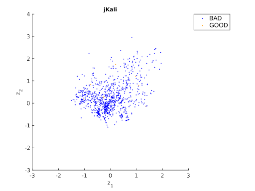
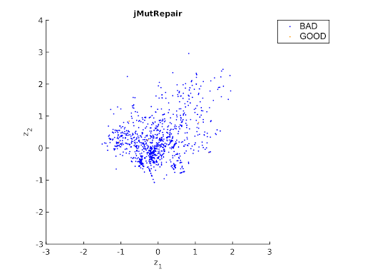
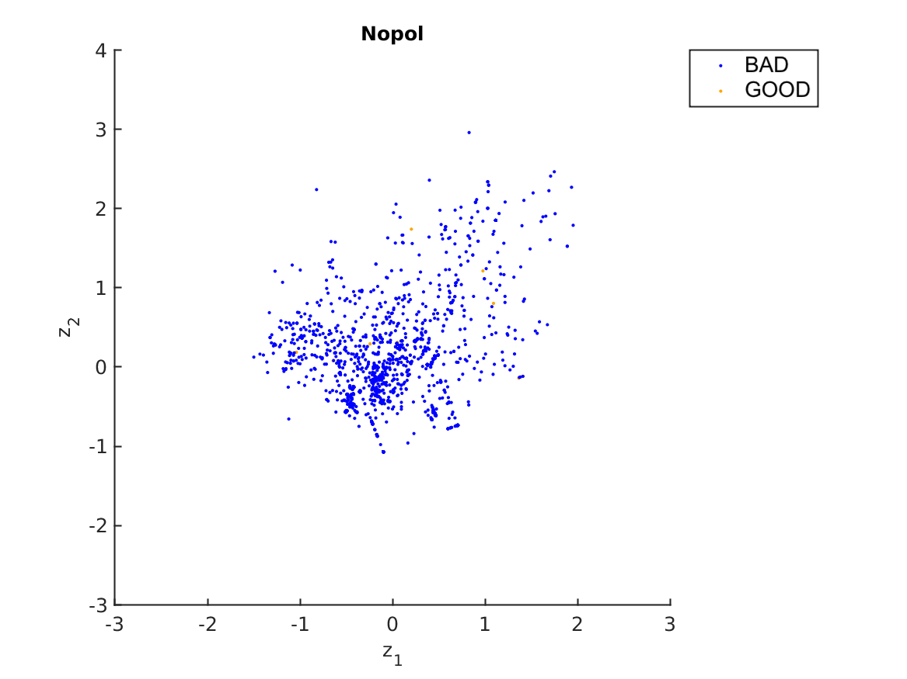
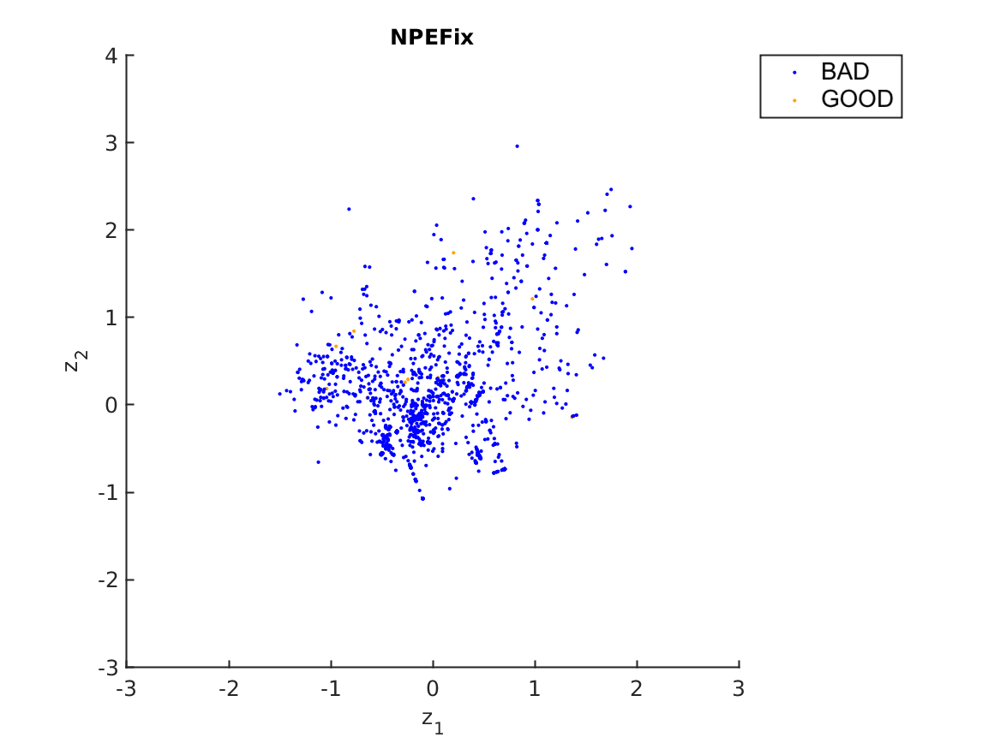
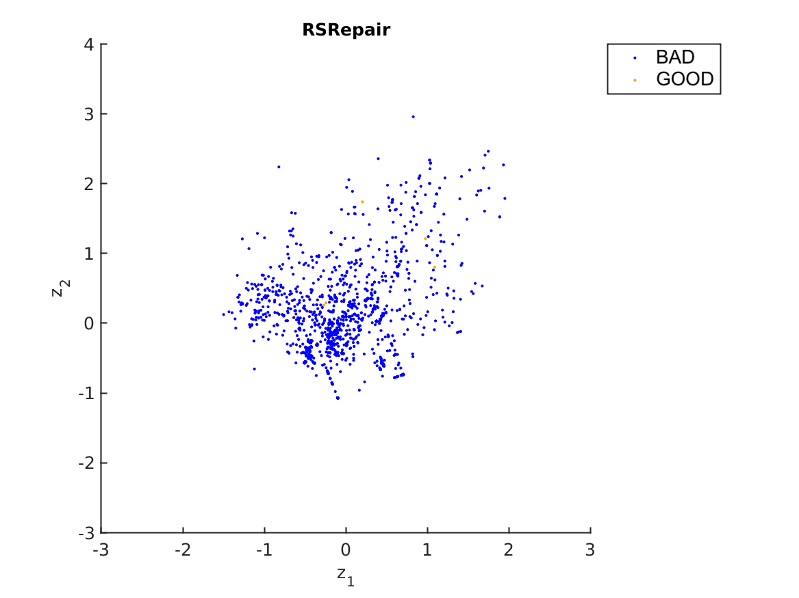

# Plots correct repaired bugs from RepairThemAll experiment


This section presents the plots that shows the repaired patches  (plausibles + correct) (labeled with **Good** ) and the not repaired patches (labeled with **bad**).
We considered the patches obtained from 16 repaired tools by Durieux et al.:

```
T. Durieux, F. Madeiral, M. Martinez, and R. Abreu, “Empirical review of java programrepair  tools:  A  large-scale  experiment  on  2,141  bugs  and  23,551  repair  attempts,”   FSE 2019
```

The correctness of the patches was determined by manual analysis conducted by Tien et al.: 

```
H. Tian, Kui Liu, A. Kaboreé, A. Koyuncu, L. Li, J. Klein, T. F. Bissyandé.  "Evaluating Representation Learning of Code Changes for Predicting Patch Correctness in Program Repair". ASE 2020.
```


## Arja


## Cardumen


## Dynamoth


## GenProg


## jGenProg


## Kali



## jMutRepair



## Kali


## Nopol



# NPEfix


## RSRepair



 